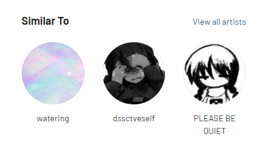
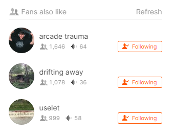

## It's pretty easy

This post is about how to discover new artists in obscure genres.

So you found this new genre/artist, it's pretty obscure, nothing really mainstream, so you might be thinking, where do I actually find more of this stuff? (or basically how I do it)

### Last.fm

Last.fm has in my experience been excellent in finding new artists in the genres I like, my favorite artists have mostly been findings from Last.fm's `Similar to` tab in an artist page.

Other thing I also like to do, is to just go to the genre's Last.fm page, go to the list of artists and then go to the depths of that, there's a lot of cool stuff to find there too.

### SoundCloud

SoundCloud's `Fans also like` tab in an artist's page is also a very good place to start exploring a new sound.

SoundCloud autoplay is also pretty good at recommending things related to what you were just listening to, but it's kind of ruined now, since SoundCloud has started favoring artists that buy their subscription, so it might be pretty random at what it gives.

## Closing words

These were the methods I personally have been using to find new music.

I'm trying to come up with things to write in this blog, maybe I will do interviews as well, who knows.
