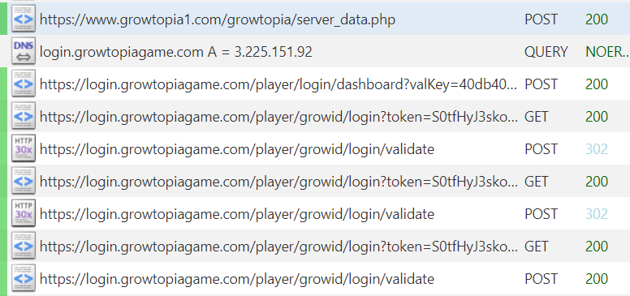
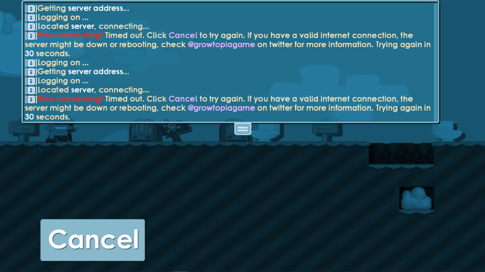

## Curiosity (me)

Have you ever thought about what is going on in the background when you are using everyday applications such as your web browser, Discord, etc?

Well I'll show you the easiest way to do it and show you how you can do some fun things with it, though I'm not going to show in detail on how to do all of it (lazy).

## Mitmproxy

The easiest way.

### Install

Installing it is as easy as typing `winget install mitmproxy`.

### Regular

So when you open it up, it automatically starts a server that listens on port 8080 on localhost. Route traffic through it and you will see domain names, status codes etc, of applications, that are configured to have their traffic routed through the proxy.

First thing you should do is configure your browser to be routed through it and go to mitm.it, so you can install the Root CA to your computer, so you get the power of inspecting HTTPS traffic too.

One powerful thing about it when proxying HTTP, is that you can Replay requests.

If you have an application that doesn't allow proxying the traffic, it requires a little know. It is doable to do it regularly, but probably easier to do it the way I'm gonna show next.

### Transparent

So this is the most powerful part about mitmproxy, you can intercept anything if you do it this way.

You insert mitmproxy at the network level, or in the place where your computer sends all the data (default gateway).

The easiest way to get this setup is to put it up and running with Docker on for example your laptop in Wireguard mode, configure your machine to use a Wireguard client to connect to your laptop, once connected, go to mitm.it and install the certs! You can open mitmproxy as a web ui with mitmweb, where you can inspect things more graphically.

## Changing up the login UI of Growtopia and configuring it to join to our server with the help of mitmproxy

I'm going to use an example of a game of my childhood called Growtopia. It got a new login system a few years ago that uses a Webview to render the login UI on the client, you see where this is going?

### Logging on...

Go to Growtopia, press Play, login to your account with GrowID and see the traffic going through your proxy.



- POST /growtopia/server_data.php: Contains the information the client needs for the login server and the game server, alongside other info irrelevant for now, as we aren't actually going to make a full fledged server. (yet?)
- POST /player/login/dashboard: Contains the html code, that is going to be displayed on the client, shows the Google, Apple and GrowID login buttons.
- GET /player/growid/login: Contains the html code with a username and password form.
- POST /player/growid/login/validate: Validates the credentials we gave to it.

This is all we need to achieve our objective. Make the domains above (with the subdomains!) to resolve to 127.0.0.1 and install mkcert to your system. Make a certificate for the domains you just configured to resolve to 127.0.0.1.

### Implementation

I'm going to use a very simple Express server for a quick PoC.

Server data:

```js
const express = require("express");
const fs = require("fs");
const https = require("https");
const app = express();
const port = 443;

app.post("/player/login/dashboard", (req, res) =>
  res.redirect("/player/growid/login")
);

app.post("/player/growid/login/validate", (req, res) =>
  res.send(`{"status":"success","message":"Account Validated.","token":"asdfaf","url":"","accountType":"growtopia"}
`)
);

app.get("/player/growid/login", (req, res) =>
  res.send(`<!DOCTYPE html>
<html lang="en" style="background-color: rgba(0,0,0,0.0); width:100%; height: 100%;">
<head>
  <meta charset="utf-8">
  <meta http-equiv="X-UA-Compatible" content="IE=edge">
  <meta name="viewport" content="width=device-width, initial-scale=1.0">
  <title>Growtopia Player Support</title>
</head>
<body style="background-color: white;">
  <form method="POST" action="https://login.growtopiagame.com/player/growid/login/validate" accept-charset="UTF-8" class="" role="form" required="required" autocomplete="off">
                              <div class="form-group">
                              <input id="login-name" class="form-control grow-text" placeholder="Your Growtopia Name *" name="growId" type="text">
                            </div>
                            <div class="form-group">
                              <input id="password" class="form-control grow-text" placeholder="Your Growtopia Password *" name="password" type="password" value="">
                            </div>
                            <div class="form-group text-center">
                              <input class="btn btn-lg btn-primary grow-button" type="submit" value="Log in">
                            </div>
                            </form>
</body>
</html>`)
);

app.post("/growtopia/server_data.php", (req, res) => {
  res.send(`server|127.0.0.1
port|17178
loginurl|login.growtopiagame.com
type|1
#maint|Server is under maintenance. We will be back online shortly. Thank you for your patience!
meta|SZSku5Iqe05kK5aqwfE165r/jjIFti4V0SGfk7Leiak=
RTENDMARKERBS1001`);
});

var privateKey = fs.readFileSync("www.growtopia1.com+3-key.pem");
var certificate = fs.readFileSync("www.growtopia1.com+3.pem");

https
  .createServer(
    {
      key: privateKey,
      cert: certificate,
    },
    app
  )
  .listen(port, () => console.log("Web server listening on " + port));
```

So I replicated the server and now when we "login", with empty credentials, something incredible happens.



### Now what?

So from this point on, the app doesn't use HTTP anymore, it sends Enet packets to the server address defined at server_data.php. They will show up as UDP in mitmproxy, as Enet is a wrapper on UDP. I haven't yet really found a good way on how I can easily inspect the server < - > client packets... yet?

If anything, we would have to make a wrapper for Enet for Node.js, as Enet is a C/C++ library, or just switch to C/C++ entirely, if we want to continue from this point on.

## Closing words

Hope you learned something from this and if I managed to ignite a little bit of interest towards these kinds of topics, good! It's very fun and if you want to, start learning more about it!
